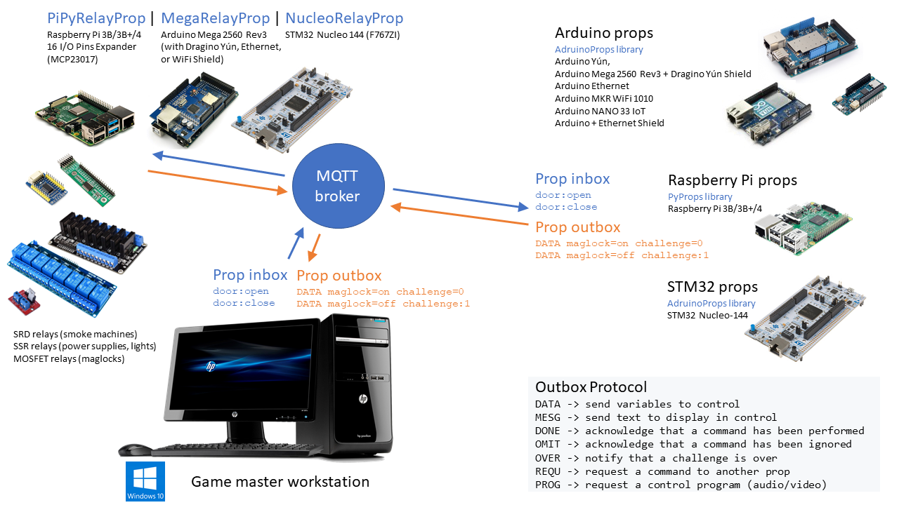

# Relay Prop
*Relay Prop for Escape Room with Arduino or Raspberry Pi board.*

 Early development stage. A lot of changes to come yet...

#### TODO
* Add password for configuration
* Relaunch/Reboot for Pi
* Add prop IP address, username and password in settings for SSH
* More checking on startup (borker/topics) to create prop.ini
* Merge PyRelaySettings and PyRelayControl in one app PyRelay
* Add MPC23017 support
* Add Mega without bridge support
* Make Pi to Mega and reverse easier for user

<hr>


This repository contains 4 projects:
* [MegaRelayProp: Room Relay Prop on Arduino Mega 2560](./MegaRelayProp)
* [PiPyRelayProp: Room Relay Prop on Raspberry Pi (3B/3B+/4)](./PiPyRelayProp)
* [PyRelaySettings: GUI configurator for Room Relay Prop](./PyRelaySettings)
* [PyRelayControl: control panel for Room Relay Prop](./PyRelayControl)

And a guide for relay modules:
* [RELAY_MODULES.md](./RELAY_MODULES.md)

##### Dev notes
- how to identify Pi4 for GPIO (same as Pi3 ?)
- config is published as JSON + anoter topic with its ID mhen updated
- `/Room/My Room/Props/Relay Pi/inbox`
- `/Room/My Room/Props/Relay Pi/outbox`
- `/Room/My Room/Props/Relay Pi/settings`


## Why do we need a Relay prop in our Escape Room?
Our goal is to give most of the electrical control to a central accessory located near the Game Master's computer or in the room's central electric cabinet.

### Benefits
* Provide power reboot for in-room props
* Most of relay modules are centralized and accessible
* Centralized 12V supply for door maglocks
* Reduce support costs with centralization and accessibility
* Centralized power shutdown to reduce electricity bills
* Inexpensive to wire the escape room like a house (star wiring)


### Recommended room network (star wiring)


### Raspberry Pi or Arduino Mega ?
For the Relay prop we recommend and provide code for Raspberry Pi and Arduino Mega.

#### Raspberry Pi 
Good choice for Python enthusiasts because we need an MQTT broker for the Escape Room and the Relay Prop on a Raspberry board can run the `mosquitto` broker.

Raspberry Pi doesn't expose a lot of pins:
* 25 pins available
* 39 pins with one 16 Pins I/O Expanders with <a href="https://www.microchip.com/wwwproducts/en/MCP23017" target="_blank">MCP23017</a> connected thru I2C

Examples of <a href="https://www.microchip.com/wwwproducts/en/MCP23017" target="_blank">MCP23017</a> expanders:
* <a href="https://www.waveshare.com/wiki/MCP23017_IO_Expansion_Board" target="_blank">Waveshare MCP23017 IO Expansion Board</a>
* <a href="https://www.amazon.fr/gp/product/B07GFQY5DW" target="_blank">Sharplace MCP23017 I/O Expander</a>

#### Arduino Mega
Good choice for people who prefer coding Arduinos rather than Python.

<a href="https://store.arduino.cc/arduino-mega-2560-rev3" target="_blank">Arduino Mega 2560</a> expose a lot of I/O: 
* 50 pins available (48 with Dragino Yún Shield)
* we don't use analog pins (due to Arduino memory constraints)

#### Do we connect the Arduino Mega with Dragino Yún or Ethernet or WiFi shield?
WiFi shield may not make much sense because in central wiring you should have a centralized Ethernet switch.

You can use the Ethernet shield coupled to a USB cable connecting the Arduino Mega to the Game Master computer. Thus, you can program the Arduino Mega from the Game Master computer and possibly remotely with <a href="https://www.teamviewer.com/" target="_blank">TeamViewer</a>.

With the Dragino Yún shield, you don't need a USB cable to program the Arduino Mega from the Game Master computer and possibly remotely with <a href="https://www.teamviewer.com/" target="_blank">TeamViewer</a> (this is what we recommend for in-room Arduino props).

> D0 (RxD) and D1 (TxD) are used by the Arduino Bridge connection.
> Ethernet and WiFi shield are connected to Arduino with SPI port.


## MegaRelayProp project
For the Relay Prop Arduino sketch to run on Arduino Mega 2560 see `MegaRelayProp.ino` sketch in [MegaRelayProp](./MegaRelayProp).

The `MegaRelayProp.ino` sketch includes `MegaRelayProp` class that extends `Props` class from <a href="https://github.com/xcape-io/ArduinoProps" target="_blank">ArduinoProps library</a>.

The Relay Prop inbox/outbox MQTT topics are:
```csharp
Room/[escape room name]/Props/[props name]/inbox
Room/[escape room name]/Props/[props name]/outbox

example:
    /Room/My Room/Props/Relay Mega/inbox
    /Room/My Room/Props/Relay Mega/outbox
```

`MegaRelayProp.ino` sketch supports:
* Arduino Mega 2560 + Dragino Yún Shield
* Arduino Mega 2560 + Ethernet Shield
* Arduino Mega 2560 + WiFi Shield

See [MegaRelayProp: Room Relay Prop on Arduino Mega 2560](./MegaRelayProp).


## PiPyRelayProp project
[PiPyRelayProp](./PiPyRelayProp) is the Python application to run on Raspberry Pi for the Relay Prop.

The Relay Prop inbox/outbox MQTT topics are:
```python
Room/[escape room name]/Props/[props name]/inbox
Room/[escape room name]/Props/[props name]/outbox

example:
    /Room/My Room/Props/Relay Pi/inbox
    /Room/My Room/Props/Relay Pi/outbox
```

See [PiPyRelayProp: Room Relay Prop on Raspberry Pi (3B/3B+/4)](./PiPyRelayProp).


## PyRelaySettings project
[PyRelaySettings](./PyRelaySettings) is a PyQt5 GUI application to configure the Relay Prop.


We usually run PyRelaySettings <a href="./PyRelaySettings#installation-on-windows" target="_blank">on Windows</a> but you can install and run it <a href="https://www.learnpyqt.com/installation/installation-linux/" target="_blank">on Linux</a> and Mac, <a href="https://www.learnpyqt.com/installation/installation-mac/" target="_blank">PyQt5 installation on Mac</a> can be tricky.

The Relay Prop configuration is publishe in a MQTT topic with twi sub-topics:
```csharp
Room/[escape room name]/Props/[props name]/settings/json
Room/[escape room name]/Props/[props name]/settings/stamp

example:
    /Room/My Room/Props/Relay Mega/settings/json
    /Room/My Room/Props/Relay Mega/settings/stamp
    
    /Room/My Room/Props/Relay Pi/settings/json
    /Room/My Room/Props/Relay Pi/settings/stamp
```

See [PyRelaySettings: GUI configurator for Room Relay Prop](./PyRelaySettings).


## PyRelayControl project
[PyRelayControl](./PyRelayControl) is the prop control panel for the Relay Prop, it's a PyQt5 GUI application to configure the Relay Prop.

We usually run PyRelaySettings <a href="./PyRelayControl#installation-on-windows" target="_blank">on Windows</a> but you can install and run it <a href="https://www.learnpyqt.com/installation/installation-linux/" target="_blank">on Linux</a> and Mac, <a href="https://www.learnpyqt.com/installation/installation-mac/" target="_blank">PyQt5 installation on Mac</a> can be tricky.

You can run [PyRelayControl](./PyRelayControl) as a *plugin for <a href="https://xcape.io/" target="_blank">xcape.io</a> Room*.


## Author

**Marie FAURE** (Apr 26th, 2020)
* company: FAURE SYSTEMS SAS
* mail: *dev at faure dot systems*
* github: <a href="https://github.com/xcape-io?tab=repositories" target="_blank">xcape-io</a>
* web: <a href="https://xcape.io/" target="_blank">xcape.io</a>